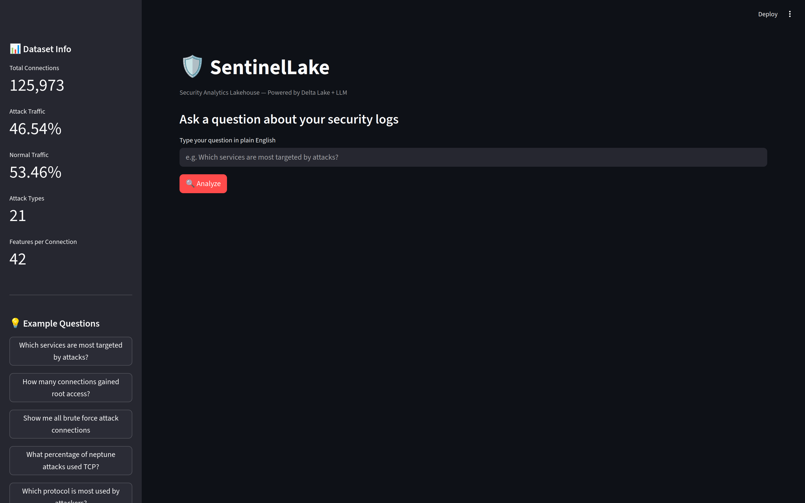
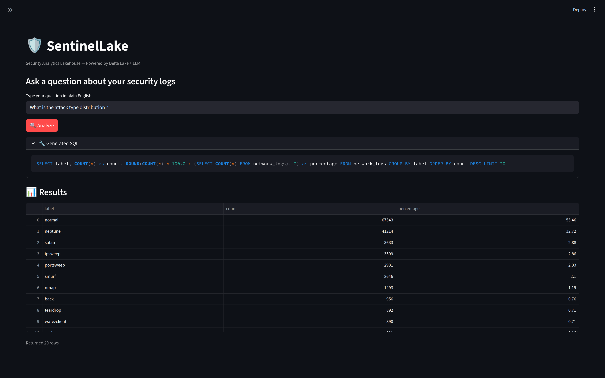
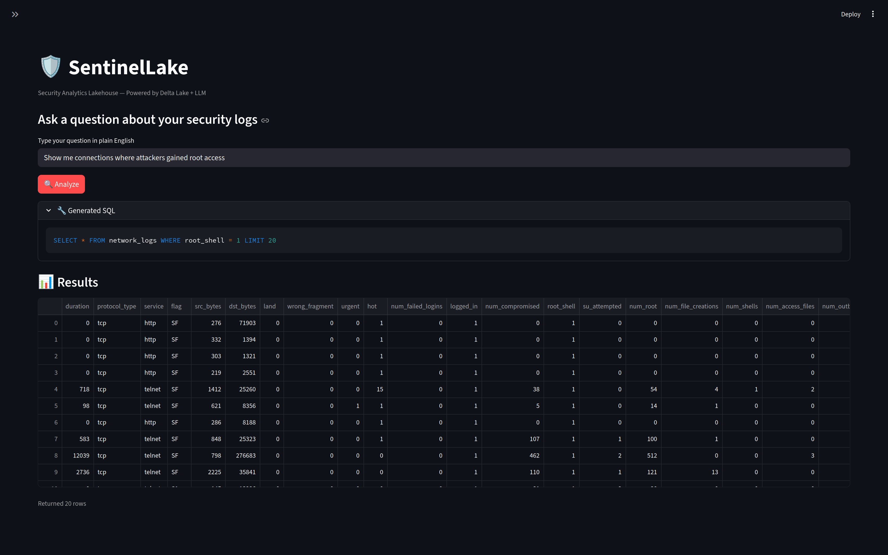
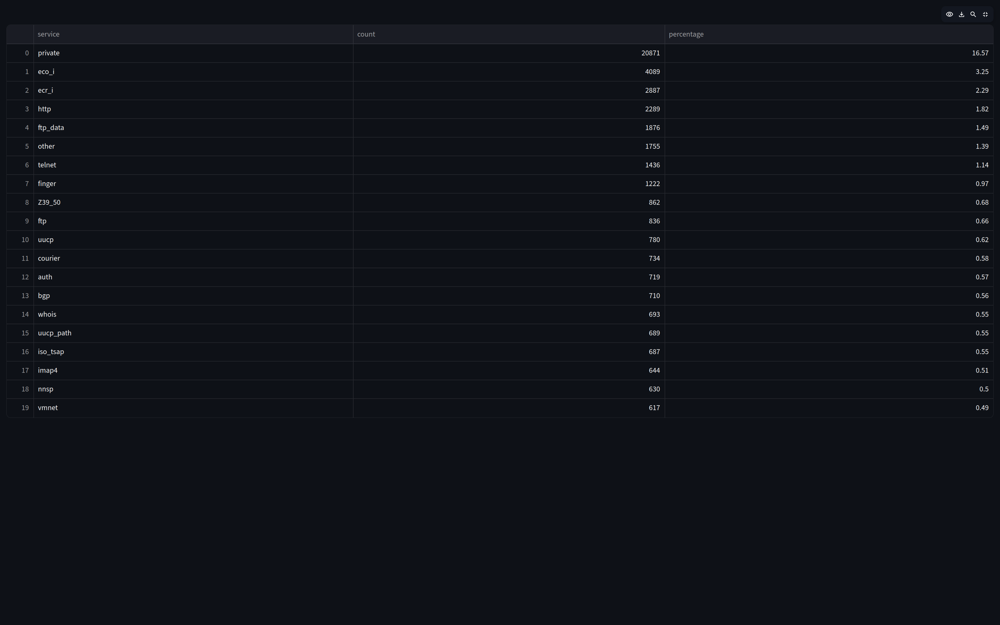

# 🛡️ SentinelLake

A security analytics lakehouse that lets you ask plain English questions
about network intrusion data and get real answers — powered by Delta Lake,
Apache Spark, and an LLM.

---

## Screenshots









---

## What It Does

Most security tools require you to know SQL or write detection rules manually.
SentinelLake lets anyone ask questions like:

> *"Which services are most targeted by attacks?"*
> *"How many connections gained root access?"*
> *"Show me all brute force attempts on telnet"*

And get real answers from 125,973 labeled network connections — instantly.

There are three layers:

**1. Storage Layer — Delta Lake**
Raw network logs ingested from the NSL-KDD dataset and stored as Delta Lake
tables. Parquet files, ACID guarantees, full transaction log. The same
architecture real companies use, running locally.

**2. Detection Layer — SQL Queries**
Six hand-written threat detection queries that find real attack patterns:
SYN floods, port scans, brute force logins, DoS signatures, privilege
escalation. Rule-based detection — the same approach SIEM tools use at their
core.

**3. AI Layer — Natural Language Interface**
Type a question in plain English. LLaMA 3.3 70B (via Groq) converts it to
SQL, runs it against the Delta Lake table, and returns results in a clean
web interface.

---

## Why I Built This

I kept hitting the same wall: I understood how attacks worked, but had no
idea how large companies actually store and analyze millions of security
events. Delta Lake was my answer to that question.

Cybersecurity at any real scale is a data problem first. This project is
me figuring out how to bridge those two things — security knowledge and
data engineering.

---

## Tech Stack

- **Apache Spark + PySpark** — distributed data processing
- **Delta Lake** — lakehouse storage (Parquet + transaction log)
- **Groq API + LLaMA 3.3 70B** — natural language to SQL
- **Streamlit** — web interface
- **NSL-KDD Dataset** — 125,973 labeled network connections, 21 attack types

---

## Project Structure

'''
sentinel-lake/
├── ingest.py          # Load NSL-KDD CSV into Delta Lake
├── queries.py         # Six threat detection SQL queries
├── llm_query.py       # CLI version of NL → SQL pipeline
├── app.py             # Streamlit web interface
├── findings.md        # What the data actually showed
├── requirements.txt
├── .env               # API keys (not committed)
└── data/              # Raw dataset (not committed)
'''

---

## Setup

**Requirements:** Python 3.9+, Java 11 or 17

```bash
# Clone the repo
git clone https://github.com/yourusername/sentinel-lake.git
cd sentinel-lake

# Create virtual environment
python3 -m venv .venv
source .venv/bin/activate

# Install dependencies
pip install -r requirements.txt

# Add your Groq API key
cp .env.example .env
# Edit .env and add your GROQ_API_KEY
# Get a free key at console.groq.com
```

**Download the dataset:**
```bash
mkdir data
cd data
wget https://raw.githubusercontent.com/Mamcose/NSL-KDD-Network-Intrusion-Detection/master/NSL_KDD_Train.csv
cd ..
```

**Ingest into Delta Lake:**
```bash
python ingest.py
```

**Run the web interface:**
```bash
streamlit run app.py
```

Open `http://localhost:8501` in your browser.

---

## Using Your Own Dataset

The project uses NSL-KDD by default. To use your own network logs,
modify `ingest.py` — update the column definitions and file path to
match your data format. The rest of the pipeline (queries, LLM layer,
UI) works without changes.

---

## Findings

See [findings.md](findings.md) for what the data actually showed —
including the class imbalance problem, the 169 successful root access
compromises, and the limitations of rule-based detection.

---

## Limitations

- No automated mitigations — detects attacks but doesn't stop them
- Research dataset — real production traffic is messier and faster
- Rule-based detection is blind to novel attacks that don't match
  known signatures — ML layer needed for anomaly detection

---

## Dataset

NSL-KDD — Canadian Institute for Cybersecurity, University of New Brunswick.
An improved version of the KDD Cup 1999 dataset for network intrusion
detection research.
